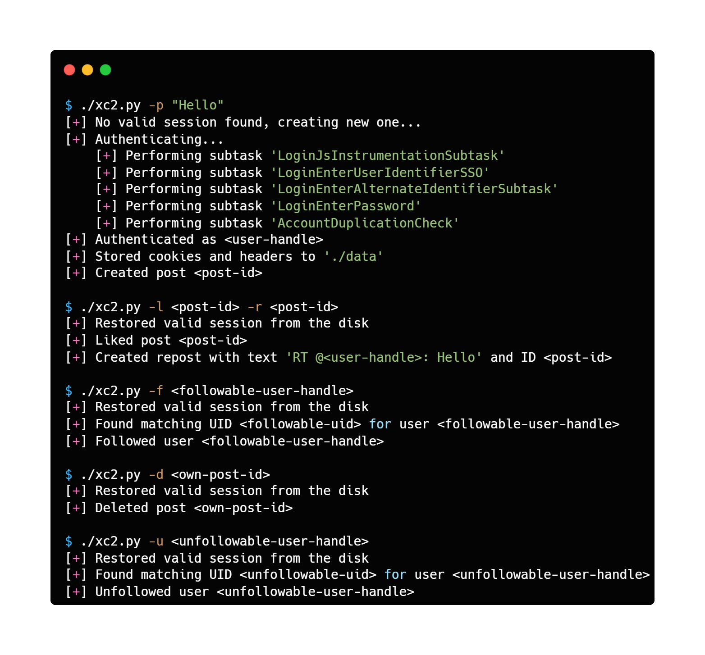

```
usage: xc2.py [-h] [-p POST] [-m MEDIA] [-l LIKE] [-r REPOST] [-d DELETE] [-f FOLLOW] [-u UNFOLLOW]

X client without consumer keys and secrets

options:
  -h, --help                            show this help message and exit
  -p POST, --post POST                  create a new post with a text
  -m MEDIA, --media MEDIA               path to the media attached to a post (requires --post)
  -l LIKE, --like LIKE                  like a post with a post ID
  -r REPOST, --repost REPOST            repost a post with a post ID
  -d DELETE, --delete DELETE            delete an existing post with a post ID
  -f FOLLOW, --follow FOLLOW            follow a user with a screen name
  -u UNFOLLOW, --unfollow UNFOLLOW      unfollow a user with a screen name
```
